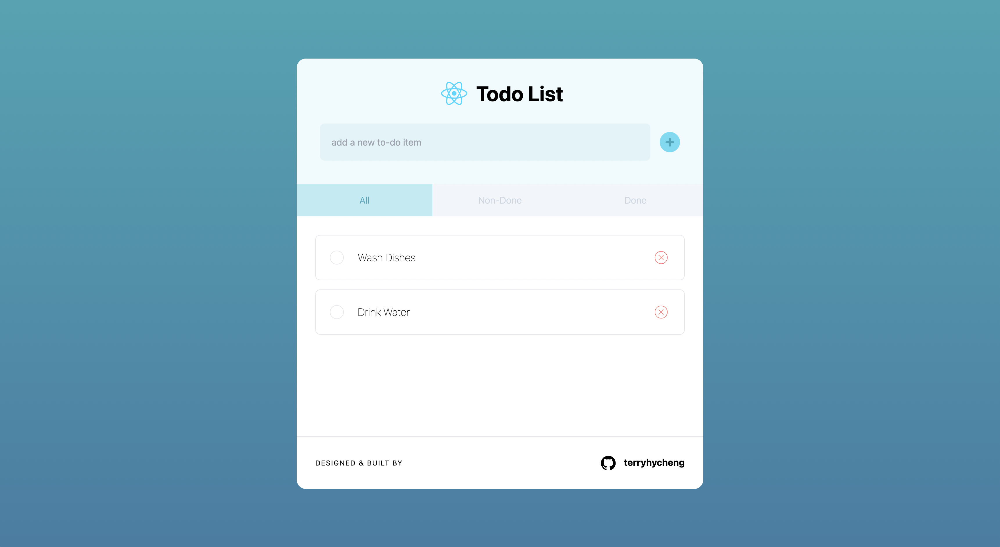
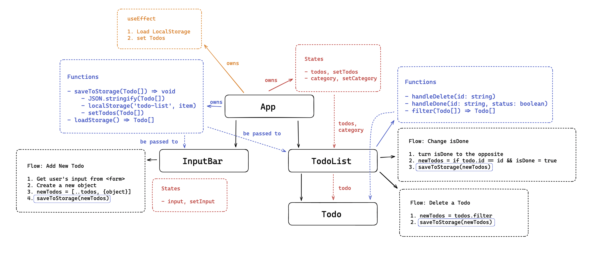

# Todo List By React

## Overview

This is a simple React project to practise all types of testing which are unit tests, integration tests & E2E tests.

➡️ UI Design on Figma: [link](https://www.figma.com/file/YpEpvtqP8jz1k8t1pSEs1k/todo-list-react?node-id=0%3A1&t=rmXjwlkmCK5QKH0N-1)

➡️ Website Demo : [link](https://todo-list-react-sooty-mu.vercel.app/)

**Features:**

- ✅ Add todos to the list
- ✅ Mark a todo as `done` or `non-done`
- ✅ Delete a todo
- ✅ Filter todos by its status of completion
- ✅ Save the todo list to the browser's `localStorage` so that the user can get the same list next time

## Table of Contents

- [Todo List By React](#todo-list-by-react)
  - [Overview](#overview)
  - [Table of Contents](#table-of-contents)
  - [User Stories](#user-stories)
  - [Component Design Diagram](#component-design-diagram)
  - [Getting Started](#getting-started)
    - [Run Dev Server](#run-dev-server)
    - [Run tests](#run-tests)
    - [Build](#build)
  - [Dependencies](#dependencies)

## User Stories

> As a user  
> So that I can check my upcoming tasks  
> I would like to see a list of todos.
>
> As a user  
> So that I can mark down a new task  
> I would like to be able to add new todos to the list.
>
> As a user  
> So that I can manage my tasks in an efficient way  
> I would like my todos to be catagorised and displayed by the status of completion.
>
> As a user  
> So that I can clear up some old tasks
> I would like to be able to remove todos from the list.

## Component Design Diagram

## Getting Started

### Run Dev Server

Run `yarn dev` to start the dev sever.

### Run tests

There are 2 options - `Vitest` and `Cypress` for runing tests.

You can run `yarn test` to test by `Vitest` or `yarn cypress:open` to have an e2e tests by `Cypress`.

To get a coverage report, you can run `yarn coverage`. A folder called `coverage` and reports in `JSON` and `HTML` format will be created in the root folder.

### Build

Run `yarn build` to build the project.

## Dependencies

- ReactJS: 18.2.0
- Cypress: 12.3.0
- TailwindCSS: 3.2.4
- React Testing Library: 13.4.0
- Jestdom: 21.0.0
- Vite: 4.0.0
- Vitest: 0.27.2
- Eslint: 8.2.0
- Prettier: 2.8.3
- uuid: 9.0.0
