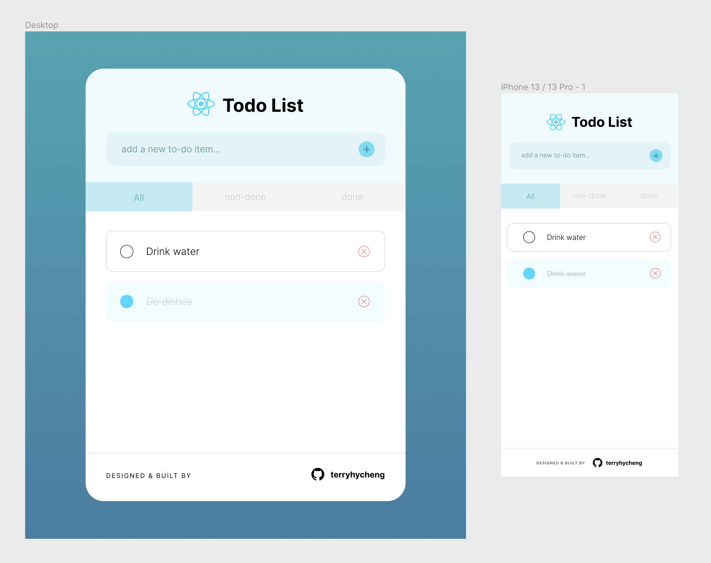
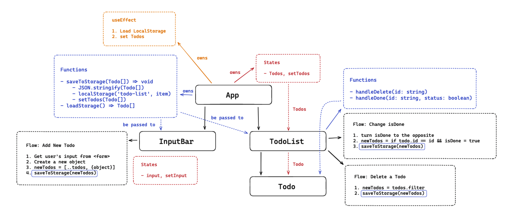

# Todo List By React

## Overview

This is a simple React project to practise all types of testing which are unit tests, integration tests & E2E tests.

➡️ UI Design on Figma: [link](https://www.figma.com/file/YpEpvtqP8jz1k8t1pSEs1k/todo-list-react?node-id=0%3A1&t=rmXjwlkmCK5QKH0N-1)

➡️ Website Demo : [link](https://todo-list-react-sooty-mu.vercel.app/)

## Table of Contents

- [Todo List By React](#todo-list-by-react)
  - [Overview](#overview)
  - [Table of Contents](#table-of-contents)
  - [User Stories](#user-stories)
  - [Component Design Diagram](#component-design-diagram)
  - [Getting Started](#getting-started)
  - [Build with](#build-with)

## User Stories

> As a user  
> So that I can check my upcoming tasks  
> I would like to see a list of todos.
>
> As a user  
> So that I can mark down a new task  
> I would like to be able to add new todos to the list.
>
> As a user  
> So that I can manage my tasks in an efficient way  
> I would like my todos to be catagorised and displayed by the status of completion.
>
> As a user  
> So that I can clear up some old tasks
> I would like to be able to remove todos from the list.

## Component Design Diagram

## Getting Started

Run `yarn dev` to start the dev sever.

## Build with

- RactJS
- Cypress
- TailwindCSS
- React Testing Library
- Jestdom
- Vite
- Vitest
- Eslint
- Prettier
